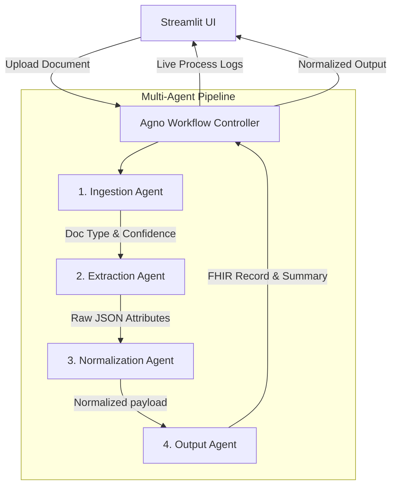

# Medical Document Intake Workflow

An intelligent, multi-agent AI pipeline for processing, extracting, and normalizing medical documents such as insurance cards, lab reports, and other medical records.

Built with **Streamlit** for a seamless user interface and orchestrated via the **Agno** agentic framework.

---

## Architecture

This project utilizes an Agentic Workflow pattern to process documents in modular, specialized steps. The entire process relies on robust vision-language models (like Gemini) to read, understand, and extract structured data from raw images.

### System Diagram



### Pipeline Stages

1. **Ingestion Stage** (`agents/ingestion_agent.py`): 
   - Analyzes the visual content of the uploaded document.
   - Detects the document type (e.g., `insurance_card`, `lab_result`, etc.).
   - Scores visibility/confidence.

2. **Extraction Stage** (`agents/extraction_agent.py`):
   - Uses the context provided by the Ingestion Agent.
   - Performs deeply detailed extraction of all valid fields present on the document.
   - Flags low-confidence extractions where text is blurry or ambiguous.

3. **Normalization Stage** (`agents/normalization_agent.py`):
   - Cleans the raw data extracted in Stage 2.
   - Standardizes formatting (e.g., date formats, casing for names, standardizing boolean fields).
   - Returns a structured, typed model payload ready for ingestion into downstream medical database systems.

4. **Output Stage** (`agents/output_agent.py`):
   - Converts the normalized payload into a FHIR-compatible structure (e.g., `MedicationRequest`, `DocumentReference`).
   - Generates a concise summary describing the intake outcome.
   - Determines and flags if the document requires manual human review based on validation status.

---

## Setup & Installation

### Prerequisites
- Python 3.9+
- An API Key for your configured language model (e.g., Google Gemini).

### 1. Clone & Set Up Environment

Create a virtual environment and install the required dependencies:

```bash
# Create a virtual environment
python -m venv venv

# Activate the virtual environment
# Windows:
venv\Scripts\activate
# Mac/Linux:
source venv/bin/activate

# Install requirements
pip install -r requirements.txt
```
*(Note: If `requirements.txt` is missing, manually install `streamlit`, `agno`, `pillow`, `python-dotenv`, and google-genai dependencies).*

### 2. Configure Environment Variables

Create a `.env` file in the root directory and add your API keys:

```env
# Example for Gemini Models
GOOGLE_API_KEY=your_google_api_key_here
```

---

## Usage

To start the UI, make sure your virtual environment is activated and run:

```bash
streamlit run app.py
```

### Navigating the UI:
1. **Upload an Image**: Drag and drop a PNG, JPG, or JPEG file of your medical document.
2. **Process**: Click **Process Document**.
3. **Live Logs**: The application intercepts standard outputs to provide real-time terminal-like insights into exactly what the agents are thinking and doing.
4. **Resiliency**: If the remote model times out or encounters a 503 error due to high demand, the workflow catches it and gracefully notifies you without crashing.

---

## Repository Structure

```text
├── agents/                  # Individual specialized Agno Agents
│   ├── ingestion_agent.py
│   ├── extraction_agent.py
│   ├── normalization_agent.py
│   └── output_agent.py      # Transforms data to FHIR schemas
├── schemas/                 # Pydantic schemas for structured data validation
├── utils/                   # Helper utilities for image loading and string manipulation
├── tests/                   # Test scripts for running and verifying agent logic in isolation
├── sample_data/             # Example medical documents for testing
├── .env                     # Environment variables (not tracked by git)
├── .gitignore               # Ignored files
├── app.py                   # Streamlit Frontend application
└── workflow.py              # Agno Workflow orchestration taking agents through steps
```

---

## Testing

Standalone test scripts are provided in the `tests/` directory to verify the individual agents without needing the full Streamlit UI:

```bash
python tests/ingestion_test.py
python tests/extraction_test.py
python tests/normalization_test.py
python tests/test_run.py
```
